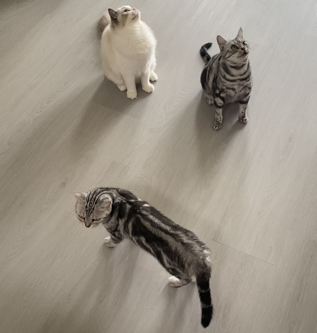

## *Baseball fan. Cat lover. Classical Music enthusiast. On the journey to explore the edge of programming languages.*

Last Updated: September 2024

<!--### About Me-->

#### Current Position
I am a research assistant at [National Taiwan University (NTU)](https://www.ntu.edu.tw/english/about/about.html) and [Academia Sinica](https://www.sinica.edu.tw/en/Tab/4), where I am fortunate to be advised by [Dr. Yih-Kuen Tsay](http://im.ntu.edu.tw/~tsay/) and [Dr. Yu-Fang Chen](https://bull.iis.sinica.edu.tw/yfc/doku.php). I obtained my bachelor\'s degree from NTU earlier this year. I will be serving in the military starting in December 2024 and expect to fulfill the obligation by April 2025. For my previous position, please see my [resume](./YuHsuanWu_resume.pdf).

#### Research Interests
My research interests are **formal verification**, **program derivation**, **automata theory**, and **functional programming**. Recently I am also working on **quantum program verification**.

> ***I am actively looking for a PhD (or thesis-based MS) position starting in 2025 Fall to continue my academic journey.***

#### Teaching
##### Teaching Assistant
- IM2009 Algorithms (taught in English): 2024 Fall
- EMBA7003 Business Decision Making: 2024 Summer
- IM1003 Programming Design: 2022 Fall, 2023 Fall
- IM2010 Operations Research (taught in English): 2023 Spring

##### Instructor
- Calculus Remedial Teaching: 2021 Fall, 2022 Spring, 2022 Fall, 2023 Spring

#### Life
Currently, I live with my family, and we have three super adorable kittens: [Dou Dou (荳荳), Hsiao Hsiao (小小), and Sha Sha (刷刷)](#kitten).

In my leisure time, I enjoy watching baseball and listening to classical music. I am a loyal fan of both the Uni-Lions and the Dodgers, with Clayton Kershaw as my favorite player. I have also played the piano and flute since a young age, and my passion for classical music continues to this day. I especially love Rachmaninoff\'s piano concertos, which are true masterpieces. I also have a deep appreciation for Dvořák\'s symphonies, which are among my favorites. *If you have not heard their works yet, I highly recommend giving them a listen!*

  
  Dou Dou (荳荳), Hsiao Hsiao (小小), and Sha Sha (刷刷)

#### Contact
The easiest way to reach me is by email: `maxyhwu dot tw at gmail dot com`.

<!--#### Baseball-->
<!--#### Classical Music-->
<!--#### Family-->
